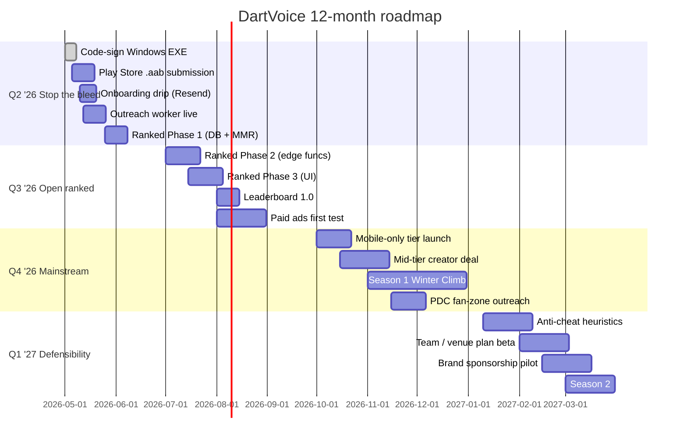

# DartVoice — Growth Plan & 12-Month Roadmap

*Internal Staff Document — Confidential. Last reviewed: April 2026.*

This is the **dated** strategic doc. It carries the live numbers (MRR, install base, pipeline state) and a quarterly timeline so we know what we're aiming at and when. The evergreen channel playbook lives in [04_ADVERTISING_AND_MARKETING.md](./04_ADVERTISING_AND_MARKETING.md); the engineering plan for ranked mode lives in [06_FUTURE_VISION_AND_MMR.md](./06_FUTURE_VISION_AND_MMR.md) and [`../ranked_mode_implementation_plan.md`](../ranked_mode_implementation_plan.md).

> **Refresh this document at the end of every month.** Other docs stay qualitative on purpose so they don't go stale.

---

## 1. Where we are today (April 2026)

### Headline numbers
- **MRR:** £74/month
- **Implied paying-subscriber count:** ~10–14 (mix of monthly £6.99, 6-month £34.99, and 12-month £59.99 plans, plus the active `PROMO_20` discount)
- **Active launch promo:** `PROMO_20` (20% off all plans), ~3 days remaining at last refresh, **being extended manually**
- **Channel mix powering current MRR:** mostly ambassador-led + organic Reddit + early Chrome Web Store traffic. Paid ads = £0.

### What's shipped
| Asset | State |
|---|---|
| Marketing site `dartvoice.app` | ✅ Live (private repo + GH Pro) |
| Stripe billing + 3-tier pricing | ✅ Live |
| Email lifecycle (transactional) | ✅ Live via Resend |
| Onboarding email **drip sequence** | ⬜ Templates exist, not yet sequenced |
| Windows desktop installer | ✅ Shipped on R2 (un-signed, SmartScreen warns) |
| Android APK | ✅ Sideload via `apk-gate.html` (R2-hosted) |
| Chrome extension | ✅ Live in Web Store |
| Ambassador / referral program | ✅ Live, £5/conversion |
| Creator outreach CRM (`admin.html`) | ✅ Live, internal-only |
| Outreach Node worker | 🟡 Schema + RPC done; retry loop in progress |
| Ranked mode (MMR) | 🟡 Plan + partial schema; UI not yet shipped |
| Play Store listing | ⬜ Pending signed `.aab` |
| Code-signed Windows installer | ⬜ Pending EV cert |

### Biggest current bottlenecks
1. **Trust friction at install** — un-signed `.exe` SmartScreen warning is silently killing ~30% of desktop conversions. EV cert fixes this.
2. **APK distribution** — sideload-via-`apk-gate` works but Play Store listing would 5–10× passive Android discovery.
3. **No onboarding drip** — we capture trial signups but don't actively nurture them between Day 1 and Day 7. Trial→Paid is leaving conversions on the floor.
4. **Outreach worker not in steady state** — the creator pipeline is the highest-leverage acquisition channel, but the worker is mid-build.

---

## 2. The 90-day plan (May–July 2026)

**Headline goal: £74 → £400 MRR by end of July.** That's roughly +50 net new paying subs at our blended ARPU (~£6.50/mo after the promo), spread over 12 weeks.

### Month 1 (May) — Plug the leaks
- ✅ **Code-sign the Windows installer.** EV cert one-time cost (~£250); recovers the ~30% conversion drop on day one.
- ✅ **Submit signed `.aab` to Google Play.** Even pre-approval, a "Coming soon" listing earns passive discovery.
- ✅ **Wire the onboarding drip in Resend** (Days 0/1/3/5/6/7 — templates already exist).
- ✅ **Finish the outreach worker** retry loop, deploy on PM2, validate end-to-end with 10 sends.
- ✅ **Extend `PROMO_20` to a defined end date** and update the welcome modal countdown accordingly.

### Month 2 (June) — Open the creator funnel
- 🎯 Run a structured **20-creator outreach sprint** through the CRM (mix of Nano + Micro tiers).
- 🎯 Target: 3 published integrations by month-end.
- 🎯 Ship **ranked mode Phase 1** (database + MMR utility functions). Partial-launch banner on `ranked.html` so creators can tease "coming soon" ranked mode.
- 🎯 Soft-launch a `/blog` SEO index with 4 cornerstone articles (see [04 §3](./04_ADVERTISING_AND_MARKETING.md)).

### Month 3 (July) — Ranked beta + first paid test
- 🎯 Ship **ranked mode Phase 2 + 3** (edge functions, dashboard tab, queue UI, leaderboard).
- 🎯 Open ranked beta to existing subscribers — **no extra cost during beta**, ranked stays bundled with the standard subscription.
- 🎯 Run a **£300 paid-ads test** across Google Search + Meta Reels using best-performing organic clips. Goal: validate sub-£15 CAC, not scale.
- 🎯 Publish "Season 0: Calibration" (placement-only ranked window).

**Exit criteria for the 90-day plan:**
- £400 MRR
- ≥ 5 published creator integrations
- Trial → Paid conversion ≥ 25%
- Monthly churn < 8%
- Ranked beta has ≥ 50 unique queuers in the first 7 days

---

## 3. The 12-month roadmap (Q2 2026 → Q1 2027)

### Quarterly view

| Quarter | Theme | Headline goal | Big shipments |
|---|---|---|---|
| **Q2 '26** (Apr–Jun) | **Stop the bleed** | £400 MRR | EV-signed `.exe`, Play Store listing, onboarding drip, ranked Phase 1, outreach worker live |
| **Q3 '26** (Jul–Sep) | **Open ranked** | £1,200 MRR | Ranked beta → 1.0, leaderboard live, first paid-ads scale-up, creator partnerships at 10+/month |
| **Q4 '26** (Oct–Dec) | **Mainstream push** | £3,000 MRR | First mid-tier (50K+) creator partnership, "Season 1: Winter Climb" with cosmetic rewards, mobile-only entry tier launched, PDC fan-zone outreach |
| **Q1 '27** (Jan–Mar) | **Defensibility** | £6,000 MRR | Anti-cheat hardening, team / venue plan beta, brand sponsorship pilot (board / shaft / flights brand on the leaderboard), ranked Season 2 |

### Visual timeline

---

## 4. Pricing experiments to run

The current 3-tier ladder is healthy but untested at scale. Run these in order, one at a time, with a clean before/after window:

| Test | Hypothesis | Risk |
|---|---|---|
| **Annual nudge in dashboard** | Existing monthly subs upgrading saves >£1.5K LTV churn | Low |
| **Mobile-only tier (£3.99/mo)** | Captures Android-first players who'd never buy desktop | Medium — cannibalisation |
| **Ranked-only tier (£3.99/mo)** | Casual players who only want the leaderboard, no scorer | Medium |
| **Team / venue plan (£24.99/mo, 5 seats)** | Pubs and league captains pay once for the whole team | Low — additive |
| **Lifetime price (£149 one-off)** | Captures founder-fan revenue early; gates ranked seasons separately | High — only run once |
| **Coupon-driven re-activation** | Cancelled users at -50% for 1 month | Low |

Every test must have a stop-rule: kill at the end of the window if the lift isn't ≥ 15% on the targeted metric.

---

## 5. Channels, ranked by current CAC potential

| # | Channel | Current state | CAC outlook | Notes |
|---|---|---|---|---|
| 1 | Ambassador referrals | Live, undermarketed | ~£5 | Cap is reach, not economics. Push every paying user. |
| 2 | Creator outreach (managed CRM) | Pipeline ramping | ~£10–30 | Scales with how many creators we ship per month. |
| 3 | Short-form social (TikTok/Reels) | Manual | ~£0 organic | Demands consistent posting; the bottleneck is editing time, not money. |
| 4 | SEO / blog | Not yet built | ~£0 organic | 3–6 month lag, then compounding. |
| 5 | Reddit / Facebook engagement | Sporadic | ~£0 | Risk of bans if mishandled. |
| 6 | Chrome Web Store ASO | Live | ~£0 | Mostly passive; ranking improves with reviews. |
| 7 | Play Store ASO | Pending submission | ~£0 | Unlocks Android passive discovery. |
| 8 | Paid Google search | Not running | £15–40 estimated | Validate in Q3 with £300 budget. |
| 9 | Paid Meta video | Not running | £15–40 estimated | Boost organic Reels first. |
| 10 | PDC / league sponsorship | Not running | High £££ | Q4+ play, not before. |

---

## 6. Brand-extension ideas (worth exploring, not yet committed)

- **DartVoice Cup** — quarterly online tournament that *uses* the ranked engine but adds a public leaderboard, sponsor branding, and a real prize. Differentiator: anti-cheat baked into the same client running the score.
- **Streaming integration** — official OBS browser-source overlay that pulls live MMR + checkout suggestions. Gives streamers a clean reason to credit DartVoice on screen.
- **Hardware partnership (badging)** — co-brand with a darts hardware vendor (board, lighting, oche mat). They include a free DartVoice month with every unit; we drive their reviews.
- **PDC commentator team-up** — sponsor a pundit's practice content. Massive halo effect for ~£500–1500 in a darts-niche market.
- **API / webhook for league software** — if league night-tracking apps could ingest DartVoice match data, we become infrastructure, not just an app.
- **DartVoice Stats Pro** — a £2/mo add-on for deep stats (heat maps, leg averages over time, weakness detection). Pure margin, easy upsell to engaged subs.

---

## 7. KPI dashboard (targets vs current)

| KPI | Current (Apr '26) | Q3 '26 target | Q1 '27 target |
|---|---|---|---|
| MRR | £74 | £1,200 | £6,000 |
| Paying subs | ~12 | ~190 | ~950 |
| Trial → Paid conversion | unknown (instrument now) | ≥ 25% | ≥ 30% |
| Monthly churn | unknown (instrument now) | < 8% | < 6% |
| CAC (blended) | ~£0 (organic only) | < £15 | < £12 |
| LTV (blended) | unknown | > £60 | > £90 |
| LTV : CAC | n/a | > 4 : 1 | > 7 : 1 |
| Referral share of new MRR | high (anecdotal) | ≥ 25% | ≥ 30% |
| Ranked weekly active queuers | 0 | ≥ 100 | ≥ 800 |

> **Action:** instrument trial → paid conversion and monthly churn in Supabase this month. We're flying blind on the two most important SaaS metrics.

---

## 8. What could go wrong

| Risk | Likelihood | Impact | Mitigation |
|---|---|---|---|
| Stripe disputes / chargebacks spike | Low | Medium | Trial structure already minimises; monitor monthly |
| Apple Play / Google Play rejection | Medium | Medium | Engage compliance docs early; have a fallback sideload (already shipping) |
| `webkitSpeechRecognition` deprecated by Chrome | Medium | High | Roadmap: replace with on-device WASM Vosk in Q4 '26 |
| Major competitor launches voice scoring | Low | High | Lean into ranked mode as the moat (utility commoditises; community doesn't) |
| Anti-cheat exploit goes viral | Medium | High | Server-side replay log + rapid-response support; never let a cheat sit untouched |
| `PROMO_20` becomes the implicit floor | Medium | Medium | Document expiry, plan an honest off-ramp ("price returns to £6.99 on X") |
| Founder bandwidth | High | High | Backend collaborator role per [07_TEAM_COLLABORATION_GUIDE.md](./07_TEAM_COLLABORATION_GUIDE.md) is the relief valve |

---

## 9. Refresh checklist (do this monthly)

- [ ] Update **MRR** and **paying subs** at the top of §1
- [ ] Tick / update progress on the 90-day plan in §2
- [ ] Update KPI table §7 with the latest values
- [ ] Promote anything from "What's shipped" 🟡 to ✅ as needed
- [ ] Move completed items in [TODO.md](../TODO.md) to ✅ Recently shipped
- [ ] If pricing changed, update [03_PAYMENT_AND_FUNNEL.md](./03_PAYMENT_AND_FUNNEL.md) and Stripe products
- [ ] If `PROMO_20` was extended/ended, update the date everywhere it appears
