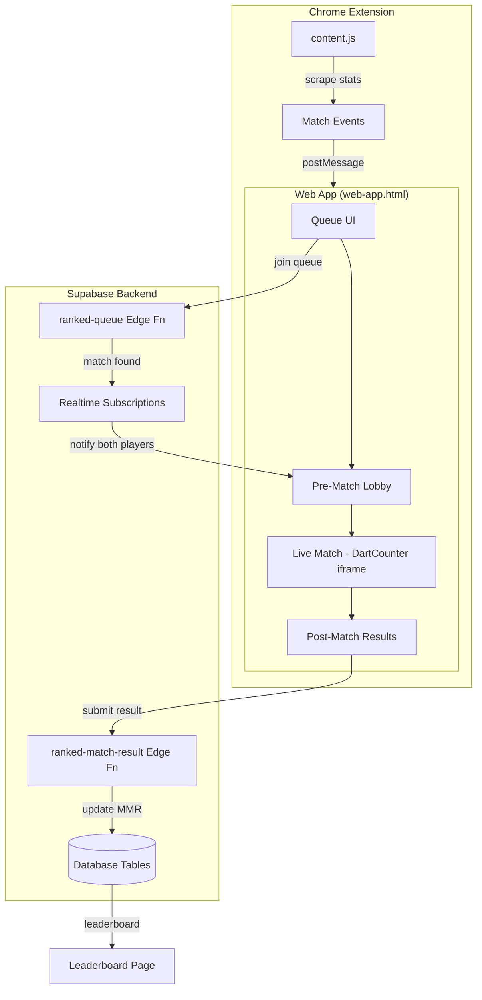
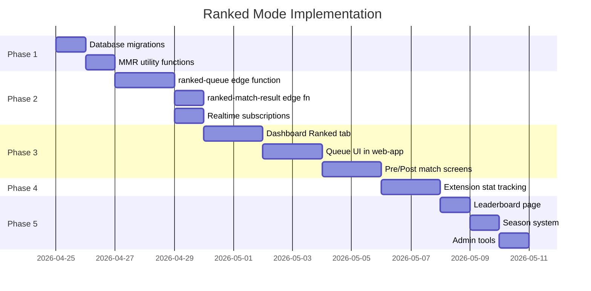

# 🎯 DartVoice Ranked Mode — Implementation Plan

> **Goal**: Add a full competitive ranked system to DartVoice — MMR, matchmaking queue, pre/post match screens, stat tracking, leaderboards, and seasonal leagues.

---

## Architecture Overview



---

## Phase 1 — Database Schema & MMR Foundations

### New Tables

#### `ranked_profiles`
Stores each player's competitive identity. Created on first ranked queue join.

| Column | Type | Default | Notes |
|---|---|---|---|
| `id` | uuid PK | — | FK → `auth.users.id` |
| `mmr` | integer | `1200` | Current Elo rating |
| `peak_mmr` | integer | `1200` | All-time highest |
| `rank_tier` | text | `'bronze'` | Computed from MMR |
| `placement_matches` | integer | `0` | Count of placement games (max 10) |
| `is_placed` | boolean | `false` | True after 10 placement matches |
| `wins` | integer | `0` | |
| `losses` | integer | `0` | |
| `win_streak` | integer | `0` | Current |
| `best_win_streak` | integer | `0` | All-time |
| `total_180s` | integer | `0` | Ranked-only |
| `total_140_plus` | integer | `0` | Ranked-only |
| `total_tons` | integer | `0` | 100+ scores |
| `total_high_finishes` | integer | `0` | 80+ checkouts |
| `best_finish` | integer | `0` | Highest checkout |
| `avg_match_average` | numeric(6,2) | `0` | Rolling average of per-match averages |
| `avg_checkout_pct` | numeric(5,2) | `0` | Rolling checkout % |
| `total_legs_won` | integer | `0` | |
| `total_legs_lost` | integer | `0` | |
| `season_id` | uuid | null | FK → `ranked_seasons.id` |
| `created_at` | timestamptz | `now()` | |
| `updated_at` | timestamptz | `now()` | |

#### `ranked_matches`
Full match record — one row per completed ranked match.

| Column | Type | Notes |
|---|---|---|
| `id` | uuid PK | `gen_random_uuid()` |
| `season_id` | uuid | FK → `ranked_seasons.id` |
| `player1_id` | uuid | FK → `auth.users.id` |
| `player2_id` | uuid | FK → `auth.users.id` |
| `winner_id` | uuid | FK → `auth.users.id` (nullable for draws) |
| `player1_mmr_before` | integer | |
| `player2_mmr_before` | integer | |
| `player1_mmr_after` | integer | |
| `player2_mmr_after` | integer | |
| `player1_mmr_delta` | integer | +/- change |
| `player2_mmr_delta` | integer | +/- change |
| `player1_legs_won` | integer | |
| `player2_legs_won` | integer | |
| `player1_average` | numeric(6,2) | |
| `player2_average` | numeric(6,2) | |
| `player1_checkout_pct` | numeric(5,2) | |
| `player2_checkout_pct` | numeric(5,2) | |
| `player1_180s` | integer | |
| `player2_180s` | integer | |
| `player1_140_plus` | integer | |
| `player2_140_plus` | integer | |
| `player1_high_finish` | integer | Best checkout that match |
| `player2_high_finish` | integer | |
| `match_format` | text | e.g. `'best_of_5'`, `'best_of_7'` |
| `status` | text | `'pending'` → `'in_progress'` → `'completed'` → `'disputed'` |
| `started_at` | timestamptz | |
| `completed_at` | timestamptz | |
| `created_at` | timestamptz | `now()` |

#### `ranked_queue`
Ephemeral queue entries — players waiting for a match.

| Column | Type | Notes |
|---|---|---|
| `id` | uuid PK | `gen_random_uuid()` |
| `user_id` | uuid | FK → `auth.users.id`, UNIQUE |
| `mmr` | integer | Snapshot at time of queue join |
| `rank_tier` | text | For display |
| `display_name` | text | Cached from profile |
| `match_format` | text | `'best_of_5'` default |
| `status` | text | `'waiting'` → `'matched'` |
| `matched_with` | uuid | Filled when matched |
| `match_id` | uuid | FK → `ranked_matches.id` |
| `joined_at` | timestamptz | `now()` |
| `expires_at` | timestamptz | `now() + interval '10 min'` |

#### `ranked_seasons`
Seasonal progression structure.

| Column | Type | Notes |
|---|---|---|
| `id` | uuid PK | |
| `name` | text | e.g. `'Season 1: Summer Climb'` |
| `starts_at` | timestamptz | |
| `ends_at` | timestamptz | |
| `is_active` | boolean | |
| `created_at` | timestamptz | `now()` |

#### `ranked_match_events`
Per-leg granular stat events (optional, for detailed match replay).

| Column | Type | Notes |
|---|---|---|
| `id` | bigint PK | Identity |
| `match_id` | uuid | FK → `ranked_matches.id` |
| `user_id` | uuid | |
| `leg_number` | integer | |
| `event_type` | text | `'score'`, `'checkout'`, `'180'`, `'140_plus'` |
| `value` | integer | Score value |
| `created_at` | timestamptz | `now()` |

### MMR / Elo System

```
Expected Score:  E = 1 / (1 + 10^((opponent_mmr - player_mmr) / 400))
New MMR:         R' = R + K × (S - E)
```

Where:
- **S** = 1 (win), 0.5 (draw), 0 (loss)
- **K-factor** varies:

| Condition | K |
|---|---|
| Placement matches (first 10) | 48 |
| MMR < 1500 | 32 |
| MMR 1500–2499 | 24 |
| MMR ≥ 2500 | 16 |

**Performance Bonus**: If a player's match average exceeds their rolling average by 15+, add +3 MMR bonus on win.

### Rank Tiers

| Tier | MMR Range | Colour |
|---|---|---|
| **Bronze** | 0 – 999 | `#CD7F32` |
| **Silver** | 1000 – 1499 | `#C0C0C0` |
| **Gold** | 1500 – 1999 | `#FFD700` |
| **Platinum** | 2000 – 2499 | `#00CED1` |
| **Diamond** | 2500 – 2999 | `#B9F2FF` |
| **Apex** | 3000+ | `#CC0B20` (brand red) |

Starting MMR: **1200** (Silver tier) — placement matches use K=48 for rapid calibration.

### RLS Policies

- `ranked_profiles`: Users can read all, update own
- `ranked_matches`: Users can read own matches (player1 or player2), insert via edge function only
- `ranked_queue`: Users can read own entry, insert/delete own, edge function manages matching
- `ranked_seasons`: Read-only for all authenticated
- `ranked_match_events`: Users can read own match events

---

## Phase 2 — Matchmaking Queue & Edge Functions

### Edge Function: `ranked-queue`

**Endpoints** (via request body `action` field):

| Action | Description |
|---|---|
| `join` | Add player to queue, auto-check for opponent within ±150 MMR (expands over time) |
| `leave` | Remove player from queue |
| `check` | Poll current status (waiting / matched) |

**Matching Algorithm**:
1. Player joins with their current MMR
2. Search `ranked_queue` for `status = 'waiting'` entries within ±150 MMR
3. If no match, widen to ±300 after 30s, ±500 after 60s, ±∞ after 120s
4. On match found:
   - Create `ranked_matches` row with `status = 'pending'`
   - Update both queue entries: `status = 'matched'`, `matched_with`, `match_id`
   - Both players receive notification via Supabase Realtime subscription on `ranked_queue`

**Supabase Realtime**: Clients subscribe to:
```js
supabase.channel('ranked-queue')
  .on('postgres_changes', {
    event: 'UPDATE',
    schema: 'public',
    table: 'ranked_queue',
    filter: `user_id=eq.${userId}`
  }, handleMatchFound)
  .subscribe()
```

### Edge Function: `ranked-match-result`

**Purpose**: Authoritative result submission + MMR calculation.

**Flow**:
1. Both players submit their view of the result (legs won each side)
2. If both agree → result is confirmed
3. If disagreement → mark `status = 'disputed'` (manual admin review later)
4. On confirmation:
   - Calculate new MMR for both players
   - Update `ranked_profiles` (mmr, wins/losses, stats)
   - Update `ranked_matches` (mmr_after, delta, completed_at)
   - Update `peak_mmr` if applicable
   - Recalculate `rank_tier` for both

### Edge Function: `ranked-stats-sync`

**Purpose**: Receive live stat data from the Chrome extension during a match.

**Flow**:
1. Extension scrapes DartCounter scores during ranked match
2. Posts stats to parent web-app via `postMessage`
3. Web-app calls this edge function periodically or on match end
4. Stores `ranked_match_events` rows

---

## Phase 3 — Web App UI

### 3a. Dashboard: New "Ranked" Tab

Add a `Ranked` tab to `dartvoice-dashboard.html` between Ambassador and Profile:

**Content when NOT placed:**
- "Start your ranked journey" hero card
- Rank tier ladder preview showing all tiers
- "Find Match" CTA button

**Content when placed:**
- **Rank Card**: Large tier badge, MMR number, peak MMR, win/loss record, win streak
- **Stats Grid**: Match avg, checkout %, 180s, 140+, high finish, legs W/L
- **Recent Matches**: Last 10 ranked matches with opponent name, result, MMR delta
- **"Find Match" button** → navigates to web-app.html in ranked mode

### 3b. Web App: Ranked Queue Screen

New state in `web-app.html` when launched in ranked mode (`?mode=ranked` or via dashboard CTA):

**Queue Searching UI**:
- Full-screen dark overlay with pulsing radar animation
- "Searching for opponent..." text with elapsed timer
- MMR range indicator showing current search bracket
- Cancel button

**Pre-Match Lobby** (after match found):
- Split-screen showing both players:
  - Avatar, display name, rank tier badge, MMR
  - Season record (W-L), match average, best finish
- Match format display (Best of 5)
- Instructions: "Create a lobby on DartCounter and share the invite"
- Input field for DartCounter lobby link OR "Send friend request" button
- "Ready" toggle for each player
- 2-minute countdown to auto-cancel if not both ready

**Post-Match Results Screen**:
- Match scoreline (e.g., 3-2)
- Both players' stats side-by-side: average, checkout %, 180s, high finish
- **MMR Change animation**: 
  - Current MMR → animated counter to new MMR
  - Green arrow (▲) or red arrow (▼) with delta
  - Rank tier change animation if applicable (e.g., Silver → Gold promotion)
- "Play Again" / "Return to Dashboard" buttons

### 3c. Leaderboard Page

New page: `leaderboard.html`

- Global top 500 ranked by MMR
- Each row: Rank #, avatar, display name, tier badge, MMR, W-L, match avg
- Filters: Season, Tier
- "Your Position" highlighted row
- Accessible from nav and dashboard

---

## Phase 4 — Chrome Extension Integration

### Stat Tracking for Ranked Matches

When a ranked match is active, the extension's `content.js` needs to:

1. **Detect ranked mode**: Parent web-app sends `{ type: 'DV_RANKED_MATCH_START', matchId, opponentId }` via `postMessage`
2. **Track per-visit scores**: Scrape the DartCounter scoreboard after each throw/visit
3. **Detect special events**: 180s, 140+, high checkouts (80+)
4. **Detect leg completion**: Watch for leg-won indicators in DartCounter DOM
5. **Detect match completion**: Watch for match-won indicator
6. **Report back**: Send `{ type: 'DV_RANKED_STATS_UPDATE', stats: {...} }` to parent on each significant event
7. **Report final**: Send `{ type: 'DV_RANKED_MATCH_COMPLETE', result: {...} }` when match ends

### New Messages (content.js ↔ web-app.html):

| Direction | Type | Payload |
|---|---|---|
| Parent → Iframe | `DV_RANKED_MATCH_START` | `{ matchId, opponentId, format }` |
| Iframe → Parent | `DV_RANKED_STATS_UPDATE` | `{ legNumber, scores[], average, checkoutPct }` |
| Iframe → Parent | `DV_RANKED_LEG_COMPLETE` | `{ legNumber, winner: 'self'|'opponent', stats }` |
| Iframe → Parent | `DV_RANKED_MATCH_COMPLETE` | `{ legsWon, legsLost, matchAvg, checkoutPct, tons180, tons140, highFinish }` |

---

## Phase 5 — Leaderboard, Seasons & Polish

### Seasonal Reset
- At season end, soft-reset MMR: `new_mmr = 1200 + (old_mmr - 1200) * 0.5`
- Archive season stats to `ranked_profiles` history
- New season entry in `ranked_seasons`

### Anti-Cheat Foundations
- Both players must confirm result (dispute if mismatch)
- Time-based anomaly detection (suspiciously fast legs)
- Future: Audio pattern analysis from extension

### Admin Dashboard
- Add "Ranked Admin" section to `admin.html`:
  - View/resolve disputed matches
  - Manual MMR adjustments
  - Season management (create, end, reset)
  - Queue monitoring

---

## Implementation Order



---

## Files to Create / Modify

### New Files
| File | Purpose |
|---|---|
| `supabase/migrations/011_ranked_mode.sql` | All new tables, indexes, RLS |
| `supabase/functions/ranked-queue/index.ts` | Queue join/leave/match logic |
| `supabase/functions/ranked-match-result/index.ts` | Result submission + MMR calc |
| `leaderboard.html` | Global leaderboard page |

### Modified Files
| File | Changes |
|---|---|
| `dartvoice-dashboard.html` | Add "Ranked" tab with profile card, stats, recent matches |
| `web-app.html` | Add ranked queue screen, pre-match lobby, post-match results |
| `chrome_extension/content.js` | Add ranked match stat tracking & reporting |
| `index.html` | Add leaderboard link to nav, mention ranked in features |
| `admin.html` / `admin.js` | Add ranked admin panel |
| `components/dv-nav.js` | Add leaderboard nav link |

---

> [!IMPORTANT]
> **Ready to proceed?** Confirm this plan and I'll begin with **Phase 1** — the database migration to create all ranked tables, indexes, and RLS policies.
